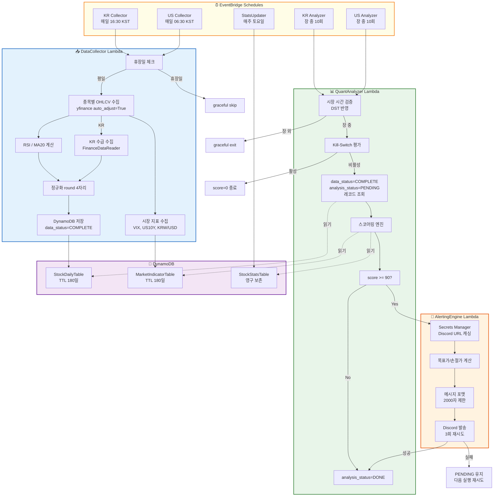
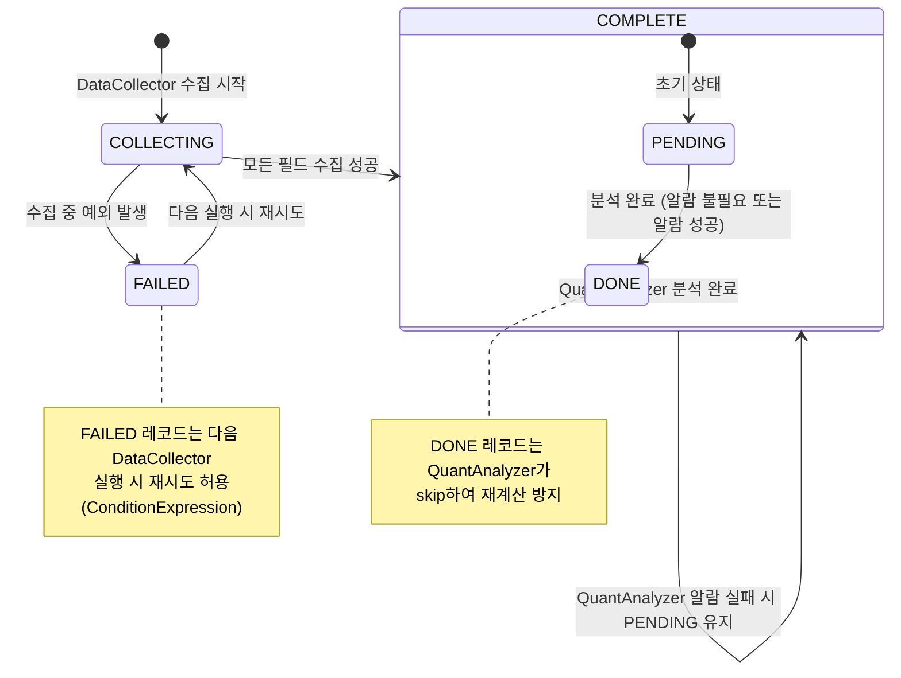

# HCSES 기술 상세 문서

## Lambda 실행 흐름



---

## 스코어링 수식

### 시장별 가중치

```
KR 시장: Valuation(40) + Momentum(30) + Supply/Demand(30) = 100점
US 시장: Valuation(60) + Momentum(40)                     = 100점
알람 임계값: total_score >= 90
```

### Valuation Floor (저평가 판별)

```
조건: current_PBR <= Min_PBR × 1.1

where:
  current_PBR = 현재 주가 / BPS
  Min_PBR     = StockStatsTable의 pbr_min_value (순수 원본 값, 팩터 미적용)
  BPS         = Stockholders_Equity / Ordinary_Shares_Number

충족 시: KR=40점, US=60점
미충족 또는 결측: 0점
```

### Momentum Pivot (기술적 반등)

```
조건: Price > MA20  AND  RSI_prev <= 30  AND  RSI_curr > 35

where:
  MA20 = 최근 20거래일 종가 단순이동평균
  RSI  = Wilder's Smoothing (ewm, alpha=1/14)

RSI 계산:
  delta    = close[t] - close[t-1]
  gain     = delta.clip(lower=0).ewm(alpha=1/14, min_periods=14).mean()
  loss     = (-delta.clip(upper=0)).ewm(alpha=1/14, min_periods=14).mean()
  RS       = gain / loss
  RSI      = 100 - (100 / (1 + RS))

충족 시: KR=30점, US=40점
미충족 또는 결측: 0점
```

### Supply/Demand (수급 — KR only)

```
조건: cum_net_buy_20d[today] > 0  AND  cum_net_buy_20d[yesterday] <= 0

where:
  cum_net_buy_20d = Σ(foreign_net_buy + institution_net_buy) over 최근 20거래일
  양전 전환 = 전일까지 음수/0 → 당일 양수로 전환

충족 시: 30점
US 시장: 항상 0점 (데이터 미제공)
결측: 0점
```

### Global Kill-Switch (시장 위험 차단)

```
다음 중 하나라도 해당 시 → total_score 강제 0점:

1. VIX > 30          (stale 지표 시: > 25)
2. US10Y 변동률 > 3%  (stale 지표 시: > 2%)
3. KRW/USD > 볼린저 상단

볼린저 상단 = MA20(KRW/USD) + 2 × σ(KRW/USD, 20일)

stale 지표: 당일 데이터 없어 전일 데이터 사용 시 임계값 보수적 강화
```

### 목표가 / 손절가

```
목표가 = 현재가 × (PBR_median / current_PBR)
손절가 = 현재가 × (PBR_min / current_PBR)

포맷:
  KR: ₩75,000  (천 단위 콤마, 소수점 없음)
  US: $182.45  (천 단위 콤마, 소수점 2자리)
```

---

## 데이터 상태 전이



---

## Seed Data 생성 (BPS 계산)

```
BPS = Stockholders_Equity / Ordinary_Shares_Number
      (yfinance quarterly_balance_sheet에서 추출)

PBR_historical[t] = Close[t] / BPS

pbr_min_value = min(PBR_historical)     ← 순수 원본 값 저장
pbr_max_value = max(PBR_historical)
pbr_median_value = median(PBR_historical)

[임계값 적용 원칙]
StockStatsTable에는 역사적 최저 PBR 원본 값만 저장.
보수적 임계값 평가는 scoring.py의 단일 로직에서만 적용:
  current_PBR <= pbr_min_value × 1.1

[설계 한계]
현재 BPS는 최신 분기 재무제표 기준 단일 값.
과거 BPS 변동은 반영되지 않음.
StatsUpdater가 매주 토요일 최신 BPS로 점진적 보정.

[어닝 시즌 리스크]
yfinance quarterly_balance_sheet는 실적 발표일과 API 업데이트 간 시차 발생.
분기 실적 발표로 BPS가 크게 변동하는 시즌에는 StatsUpdater 주 1회 동기화만으로
잘못된 목표가/손절가가 산출될 수 있음.
대응: 실적 발표 직후 StatsUpdater 수동 트리거 권장.
```

---

## Rate Limiting 전략

```
종목 간: time.sleep(random.uniform(1, 3))
yfinance: 비공식 API → 단시간 대량 호출 시 IP 차단 위험
50종목 기준: 최대 150초 추가 소요 허용
```

---

## 멱등성 보장 (TC-01)

```python
# DynamoDB PutItem 조건부 쓰기
ConditionExpression = (
    Attr("ticker").not_exists() |     # 신규 레코드
    Attr("data_status").eq("FAILED")  # FAILED 재시도 허용
)
# COMPLETE 레코드 존재 시 → ConditionalCheckFailedException → skip (정상)
```
